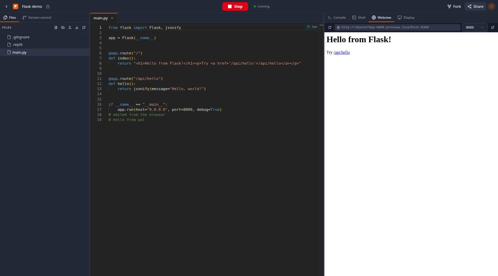
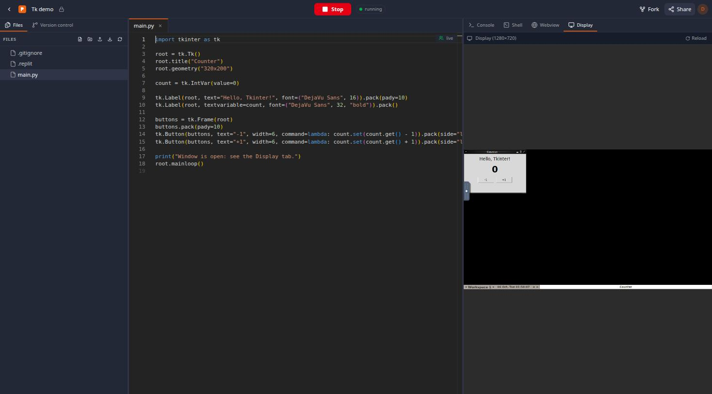

# Repl

A self-hosted clone of 2020-era Replit. Pick a language or framework, get a
real Linux container, and write and run code from the browser. Each repl comes
with:

- **Editor:** Monaco with file tabs and multiplayer editing (Yjs + Hocuspocus,
  live cursors).
- **Console:** the Run button. One shared process per repl, with scrollback
  that survives reloads.
- **Shell:** a full bash shell in the container.
- **Webview:** any server you start (Flask, Express, Spring Boot, Vite...) shows
  up at `http://{repl}-{port}.preview.localhost:8380`.
- **Display:** a VNC desktop for Tkinter, Swing and pygame, rendered with noVNC.
- **Version control:** each repl is a git repo, with commit, history, diff and
  restore built in.
- **Packages:** search and install from PyPI, npm, crates.io, Go modules,
  RubyGems, Packagist, Maven Central, NuGet, CRAN, CPAN, LuaRocks and Hackage
  in the Packages panel. Run installs what the manifest lists and what the code
  imports, and packages stay installed across container restarts.
- **Sharing:** add collaborators as viewer or editor, make repls public, fork
  them, and browse public repls on Explore.

Every language runs its latest stable release: Python 3.14, Node 26, Go 1.27,
Rust 1.99, Java 27, .NET 10, GCC 16, Clang 23, Ruby 4.0, PHP 8.5, and so on.
`make versions` prints the full list and `make update-versions` bumps the pins
(details in [DESIGN.md §5](docs/DESIGN.md#toolchains-are-current-upstream-releases)).

There are 35 templates, all smoke-tested in the image:

- **Languages:** Python, Node.js, TypeScript, Java, Kotlin, C, C++, C#, Go,
  Rust, Ruby, PHP, Lua, Perl, Bash, Haskell, R, Fortran, Pascal, NASM, Scheme,
  Common Lisp
- **Web:** Flask, FastAPI, Django, Express, PHP, Spring Boot, Go net/http,
  static HTML/CSS/JS
- **Frameworks:** React + Vite, Vue + Vite
- **GUI:** Tkinter, Java Swing, pygame

| Flask with a live web preview | Tkinter on the VNC display |
|---|---|
|  |  |

See **[docs/DESIGN.md](docs/DESIGN.md)** for the architecture, API, and the
reasoning behind each decision.

## Quick start

Requirements: Docker with Compose v2, and roughly 10 GB of disk for the runner image.

```bash
cp .env.example .env        # then fill in the secrets and REPLS_HOST_DIR (an absolute path)
make up                     # builds the polyglot runner image and the stack
open http://localhost:8380
```

`make up` is equivalent to:

```bash
docker build -t repl-polyglot:latest runner/
mkdir -p "$REPLS_HOST_DIR"
docker compose up -d --build
```

Previews rely on `*.localhost` resolving to loopback, which Chrome, Firefox and
Safari all do with no setup.

### Development mode

```bash
docker compose -f docker-compose.yml -f docker-compose.dev.yml up -d   # backend + collab auto-reload
cd frontend && npm ci && npx vite --port 5173                         # SPA with HMR on :5173
```

The Vite dev server proxies `/api`, `/ws` and `/collab` to nginx on :8380.

End-to-end test through nginx (requires `pip install aiohttp`):

```bash
python3 scripts/smoke_test.py http://localhost:8380 python c flask express
```

Package management for every language (search, install, run, restart, remove):

```bash
python3 scripts/packages_test.py http://localhost:8380
```

## Layout

```
backend/        FastAPI: auth, repls, files, git, container runtime, sharing
  app/templates_data/   one folder per template + index.json
collaboration/  Hocuspocus server (rooms per open file; disk is the source of truth)
frontend/       React + Vite + shadcn/ui SPA
nginx/          gateway: SPA, API, auth-gated container websockets, preview subdomains
runner/         "polyglot" image (every toolchain) + in-container agent
docs/DESIGN.md  design document
```

## Architecture in one picture

```
Browser ─▶ nginx ─┬─▶ SPA
                  ├─▶ /api ─▶ FastAPI ─┬─▶ Postgres
                  │                    ├─▶ Docker (create/start/stop repl-{id})
                  │                    └─▶ repl dirs on disk (git working trees)
                  ├─▶ /collab ─▶ Hocuspocus ─▶ FastAPI internal file API
                  ├─▶ /ws/repls/{id}/{run,shell,vnc} ─(auth_request)─▶ repl-{id} agent / noVNC
                  └─▶ {id}-{port}.preview.* ─▶ repl-{id}:{port}
```
